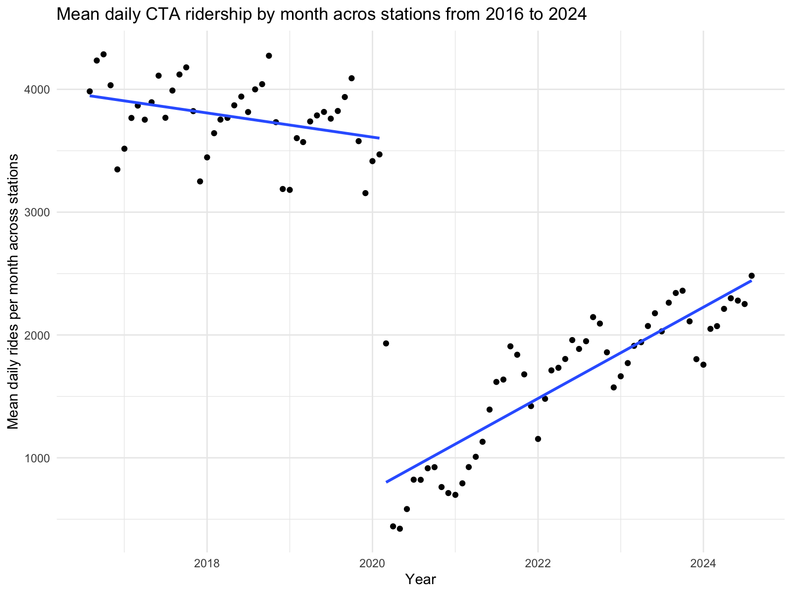
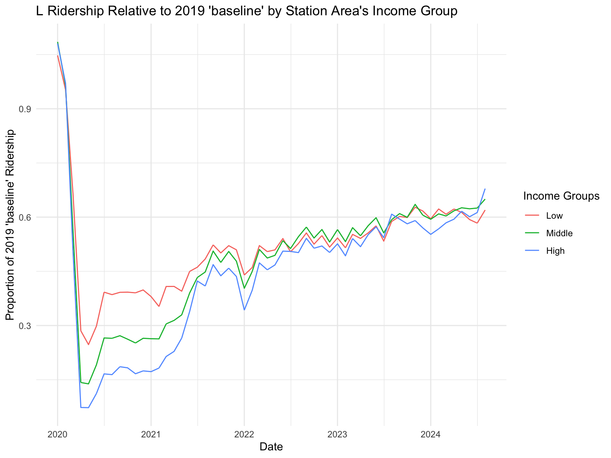

# CTA-L-Ridership

## CTA L Ridership Recovery Post-Pandemic (COVID-19)

This project is an analysis of changes in L ridership following the COVID-19 pandemic onset, and will explore whether recovery differed according to economic characteristics (income) of the census tract containing the CTA station. For the sake of this project, I will consider ‘2020-03-01’ the start of the pandemic, and ‘2023-05-01’ the end.

Raw, unclean ridership data was taken from the Chicago Data Portal, provided by the CTA, as well as income by census tract from the ACS (American Community Survey). Geospatial data for CTA station locations and census tract borders were also taken from the Chicago Data Portal. R (ggplot2, dplyr, sf), Excel, and Power Query were used to develop this project.

## Overview

The 2020 pandemic was the catalyst of a major disruption to public transit usage in Chicago. By examining ridership from 2016 through 2024 with emphasis on the magnitude of post-onset recovery, I will address two questions:

1.	How did CTA L ridership change, post-onset of the pandemic? 
2.	What were the variations in CTA L ridership recovery according to the economic characteristics (income) of the neighborhood where the CTA station resides?

## Results

First, by plotting tidy/clean ridership data from 2016 to 2024, a steep cut-off can be seen following the start of the pandemic in 2020. It subsequently saw a gradual, but incomplete recovery by 2024.

Then, by plotting proportion of ridership recovery across income groups (low, middle, high) starting 2020, the greatest differences between low, middle, and high-income groups can be observed within the first year and a half of the pandemic. After mid-2021, the ridership recovery gaps shrink, although there is still an observable difference.

The linear correlation between the income measure (“income index”) and ridership recovery skewed negative, meaning recovery was weaker as the income index of the census tract containing the CTA station increased. Although a negative correlation was computed, it was found to be statistically insignificant.

## Visuals

- Monthly CTA L ridership from 2016-2024, visualizing the cutoff at around March 2020 and the subsequent recovery.

- Monthly ridership recovery relative to 2019 baseline, grouped by income group (low, mid, high) of the census tract containing the CTA station.

## Repository contents
- report/  A detailed (knitted) R markdown file
- scripts/  R scripts used for data cleaning and analysis
- plots/  Contains all visuals generated using ggplot2 from '01_ridership_analysis.R'
- rawdata/ Contains all raw datasets used for this project
- cleandata/ Contains all prepared datasets using Excel, Power Query, and R

## Sources
- All found through Chicago Data Portal
- CTA Ridership daily totals [link](https://data.cityofchicago.org/d/5neh-572f)
- CTA L rail stations geospatial data [link](https://data.cityofchicago.org/d/3tzw-cg4m)
- U.S. Census Bureau Census Tract Data [link](https://data.cityofchicago.org/d/4hp8-2i8z)
- American Community Survey 5 year data by community area [link](https://data.cityofchicago.org/d/t68z-cikk)

## Limitations
Be advised that the (cleaned) data provides the income measure of the census tract that contains the CTA station. It should not be interpreted as a measure of the individual income of CTA riders. It only accounts for rides recorded at each station, and does not tell us which tract in which the rider resides.

The census income data used is representative of people's income living in these census tracts *in 2023*, well after the pandemic had begun. It does not measure changes in tract income over the full period. Also, since we were only given income "buckets," it was necessary to construct *income index*. 

